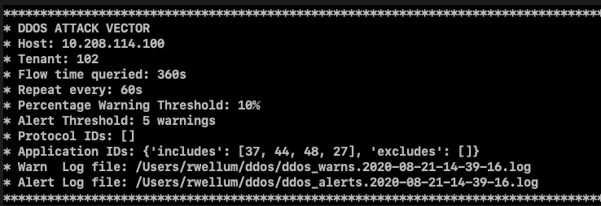
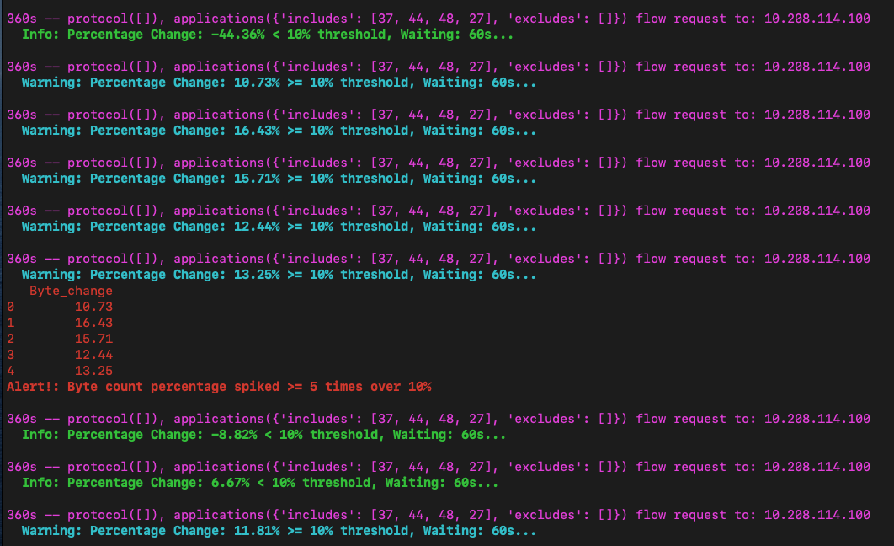

# DDOS detection

`sta_ddos.py` is a tool to perform rate of change inspections on protocols -
to warn on potential DDOS attacks. It is yaml driven and easy for the end user
to make changes and apply.

Key objectives:

1. Ability to detect DOS and DDOS attacks, on any application or applications that Stealthwatch recognizes.
2. Human readable and editable configuration (yaml) - no programming skills needed to make application behavior changes.
3. Ability to set thresholds and alert and warn. Eventually alerts and warns sent to SIEM or SecureX.
4. Queries SMCs using APIs, so not intrusive on FCs and also has access to all FCs - hence better at detecting DDOS attacks across entire infra-structure.
5. Uses Active flows so reduces noise or data that occurred in the past.

## Typical DDOS Attack Vector Header



## Sample output from running investigation



## Basic concept

This tool will constantly query an SMC, for flows for a particular protocol and
application profile.

A typical payload looks like:

```bash
SMC Query Payload: {
  "startDateTime": "2020-08-19T13:24:50Z",
  "endDateTime": "2020-08-19T13:30:50Z",
  "subject": {
    "orientation": "Either"
  },
  "flow": {
    "flowDirection": "BIDIRECTIONAL",
    "applications": {
      "includes": [
        37,
        44,
        48,
        27
      ],
      "excludes": []
    },
    "protocol": [],
    "includeInterfaceData": "true"
  }
}
```

The tool is fairly configurable, using the yaml configuration file the user can
change:

```bash
verbose: false # Set me to true to see lots of output
enabled: true
dos_flow_time: 360 # Look at 5m sliding window (enough time to gather from FCs)
dos_flow_repeat_time: 5 # Query each 60s
dos_threshold: 5 # % spike causes a table entry and warning
dos_spike: 2 # int consecutive dos_thresholds is an alert
protocol: [] # Change protocols here (1 = ICMP) etc.
applications: { includes: [37, 44, 48, 27], excludes: [] } # Change applications here (44 = SSH) etc.
```

The concept is simple:

The user selects a window of time `dos_flow_time` to look at any
combination of protocols `protocols` and applications `applications`. At a
configurable repeat time `dos_flow_repeat_time` the same query is repeated. The
data returned is reduced to byte counts per configured protocol and application
and most importantly `non-active` flows are removed. We only care about live
and active flows. This is not a historical flow inspection.

Now that we have only **active byte** counts for the protocols and applications we
care about, the percentage change between the current data and the last data is
calculated. If this percentage change is higher than `dos_threshold` then a
warning is triggered. And if more than `dos_spike` warnings are seen in the
last five queries, an alert is triggered.

The alerts and warnings are saved in an output log files.

## Setup

### Create a python3 virtual environment

```bash
virtualenv ddos_python
```

### Activate virtual env

```bash
source ddos_python/bin/activate
```

### Install requirements

```bash
pip3 install -r requirements.txt
```

### Edit config.yaml - add your SMC details and also edit your ddos settings

CANA Application ID's are found here: <https://www.iana.org/assignments/protocol-numbers/protocol-numbers.xhtml>

Stealthwatch Protocol ID's are found here:
<https://www.cisco.com/c/dam/en/us/td/docs/security/stealthwatch/management_console/default_applications_definitions/SW_7_0_Default_Applications_Definitions_DV_1_0.pdf>

Typical example of a common protocol profile:

ICMP
SSH
Telnet
NetBIOS

This would be represented by:

```bash
dos_attack:
    verbose: false # Set me to true to see lots of output
    enabled: true
    dos_flow_time: 360 # Look at 5m sliding window (enough time to gather from FCs)
    dos_flow_repeat_time: 5 # Query each 60s
    dos_threshold: 15 # % spike causes a table entry and warning
    dos_spike: 5 # int consecutive dos_thresholds is an alert
    protocol: [] # Change protocols here (1 = ICMP) etc
    applications: { includes: [37, 44, 48, 27], excludes: [] }
```

Note that is aggregating the total bytes of all these applications.

### Run tool

```bash
./sta_ddos.py config.yaml
```

### Run tool in verbose mode for more info

```bash
./sta_ddos.py config.yaml -v
```
