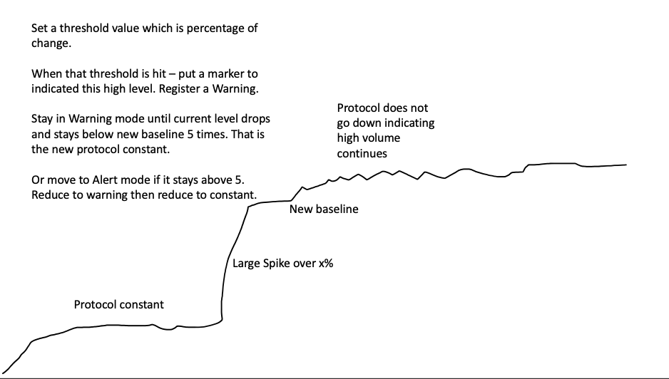

# Application and Protocol Rate of Change Detection

## Helicopter view

`sta_ddos.py`:

- is a Stealthwatch tool to perform rate of change inspections on
protocols, applications and combinations of both if desired - to warn on
potential DDOS or other cyber attacks.
- is yaml configuration driven and easy for the end user to configure with no
programing knowledge required.
- uses public available API's.
- reports status changes in three levels of concern: `green`, `yellow` and `red`.
- uses a simple algorithm that looks for a rate of change
- provides an `inspect` mode to help the user to determine what their baseline
  byte counts are.

### Key objectives

1. Ability to detect DOS and DDOS attacks, on any application or applications that Stealthwatch recognizes.
2. Human readable and editable configuration (yaml) - no programming skills needed to make application behavior changes.
3. Ability to set thresholds and alert and warn. Eventually alerts and warns sent to SIEM or SecureX.
4. Queries SMCs using APIs, so not intrusive on FCs and also has access to all FCs - hence better at detecting DDOS attacks across entire infra-structure.
5. Runs continuously - set it and watch.

### Algorithm



## Basic premise

This is a two step tool.

### Step1. Run the tool with a `--inspect` switch

In this mode the tool will continuously query for the total byte count of a
particular protocol profile, and creating a mean value seen. This mean value is
then used in Step 2 to determine potential maliscious rates of change. The user
can run this as long as needed, the longer the better is the assumption.

### Step 2. Run the tool

This tool will continually query an SMC for flows of a particular protocol and
application profile configured by the user, over the time period now - five
minutes.

The baseline is set by the config param ``dos_baseline``. Populate this with
the results of running this profile in ``--inspect`` mode. If set to ``0`` - then
sta_ddos will attempt to form a dynamic baseline from the previous 5 queries.
This may result in less accurate alerts..

The flows are aggregated by byte count and stored in a Pandas Series. Each new
total is compared to the one below. If a percentage change above the configured
threshold value is detected, then the tool enters the alerting protocol.

If the tool is stopped, then the average byte count for that protocol is also
displayed. This can be used as an alternative to running in inspect mode.

### The alerting protocol

There are three levels of alerting:

1. Green - all is good, nothing to report
2. Yellow - a protocol byte increase above the threshold has been detected
3. Red - protocol byte count has stayed above the threshold

When the threshold is first breached, then we enter the Yellow Warning level.
The Baseline Threshold Value is stored.

To get out of this level, we will have to detect 5 successive lower total byte
counts than the baseline Threshold value. If that occurs we go back to Green
level and the Baseline Threshold will start again.

However if in Yellow Warning level we get 5 successive higher than the baseline
readings then we enter: Red Alert status. There will be stay until we get 5
readings below the baseline threshold level.

## Typical DDOS Attack Vector Header


## Sample output from running investigation


## Basic concept

This tool will constantly query an SMC, for flows for a particular protocol and
application profile.

A typical payload looks like:

```bash
SMC Query Payload: {
  "startDateTime": "2020-08-19T13:24:50Z",
  "endDateTime": "2020-08-19T13:30:50Z",
  "subject": {
    "orientation": "Either"
  },
  "flow": {
    "flowDirection": "BIDIRECTIONAL",
    "applications": {
      "includes": [
        37,
        44,
        48,
        27
      ],
      "excludes": []
    },
    "protocol": [],
    "includeInterfaceData": "true"
  }
}
```

The tool is fairly configurable, using the yaml configuration file the user can
change:

```bash
verbose: false # Set me to true to see lots of output
enabled: true
dos_flow_time: 360 # Look at 5m sliding window (enough time to gather from FCs)
dos_flow_repeat_time: 5 # Query each 60s
dos_threshold: 5 # % spike causes a table entry and warning
dos_baseline: 25511156 # Baseline byte value - set to 0 if -i not run
protocol: [] # Change protocols here (1 = ICMP) etc.
applications: { includes: [37, 44, 48, 27], excludes: [] } # Change applications here (44 = SSH) etc.
```

The concept is simple:

The user selects a window of time `dos_flow_time` to look at any
combination of protocols `protocols` and applications `applications`. At a
configurable repeat time `dos_flow_repeat_time` the same query is repeated. The
data returned is reduced to byte counts per configured protocol and
application. We only care about live and active flows. This is not a historical
flow inspection.

Now that we have only **active byte** counts for the protocols and applications we
care about, the percentage change between the current data and the last data is
calculated. If this percentage change is higher than `dos_threshold` then a
warning is triggered.

In either mode, if the user breaks execution with `CTRL-C`, then the mean of
all the bytes from all queries is returned and can be used to re-populate the
`dos_baseline` value in the config.

## Setup

Assumption is that the user has Python3 installed.

### Upgrade pip3

```bash
python3 -m pip install --upgrade pip
```

### Install Virtual Env

```bash
pip3 install virtualenv
```

### Create a python3 virtual environment

```bash
virtualenv -p python3 ddos_python
```

### Activate virtual env

```bash
source ddos_python/bin/activate
```

### Install requirements

```bash
cd ~/ddos
pip3 install -r requirements.txt
```

### Edit config.yaml - add your SMC details and also edit your ddos settings

CANA Application ID's are found here: <https://www.iana.org/assignments/protocol-numbers/protocol-numbers.xhtml>

Stealthwatch Protocol ID's are found here:
<https://www.cisco.com/c/dam/en/us/td/docs/security/stealthwatch/management_console/default_applications_definitions/SW_7_0_Default_Applications_Definitions_DV_1_0.pdf>

Typical example of a common protocol profile:

ICMP
SSH
Telnet
NetBIOS

This would be represented by:

```bash
dos_attack:
    verbose: false # Set me to true to see lots of output
    enabled: true
    dos_flow_time: 360 # Look at 5m sliding window (enough time to gather from FCs)
    dos_flow_repeat_time: 60 # Query each 60s
    dos_threshold: 15 # % spike causes a table entry and warning
    protocol: [] # Change protocols here (1 = ICMP) etc
    applications: { includes: [37, 44, 48, 27], excludes: [] } # Change Apps here
```

Note that is aggregating the total bytes of all these applications.

### Run tool

#### Inspect Mode

```bash
./sta_ddos.py config.yaml -i
```

#### Detect and Alert Mode

```bash
./sta_ddos.py config.yaml
```

#### Detect and alert mode with verboseness

```bash
./sta_ddos.py config.yamln -v
```

## Docker (TBD)

This script is Docker friendly, and can be deployed as a container.

To build the container, run the script once to populate the ***config.json*** file, or manually populate the configuration variables.

Once the ***config.json*** file is populated, run the following command to build the container:

- ```docker build -t maxmind-asn-importer .```

You can then run the container as a daemon with the following command:

- ```docker run -d --name maxmind-asn-importer maxmind-asn-importer```
